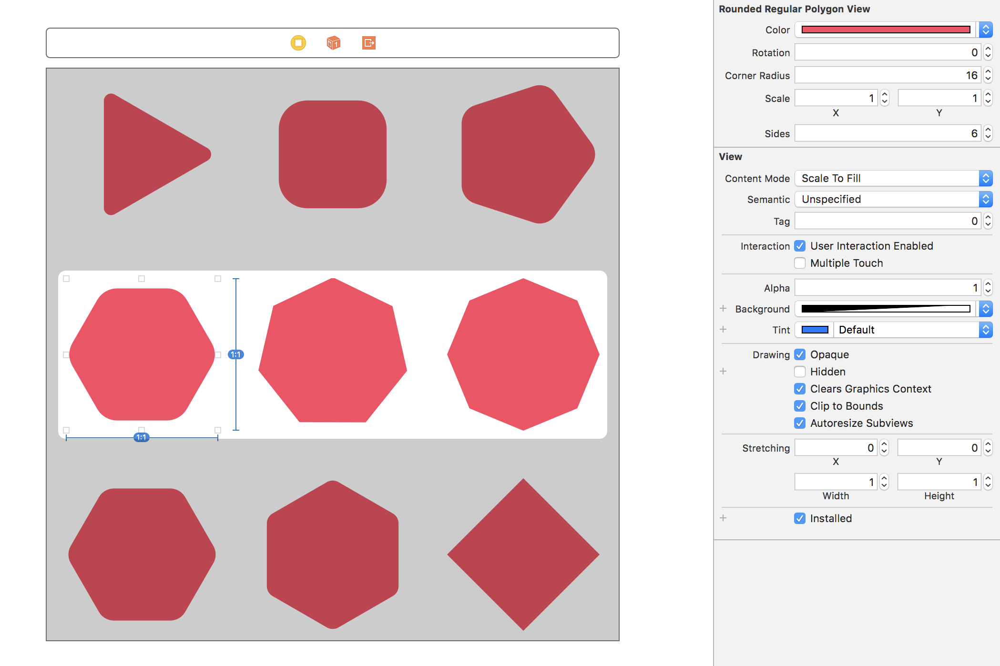

# UIBezierPath + Polygons

This project adds a conveinence initalizer to UIBezierPath for generating n-sided regular polygon paths – with rounded corners support – in Swift! 

Also included is `RoundedRegularPolygonView`, a UIView subclass with IBInspectables for certain path properties.

## Requirements

* iOS 8.0+
* Xcode 9.0+

## License

This project is available under the MIT license. See the LICENSE file for more info.